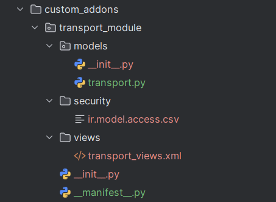
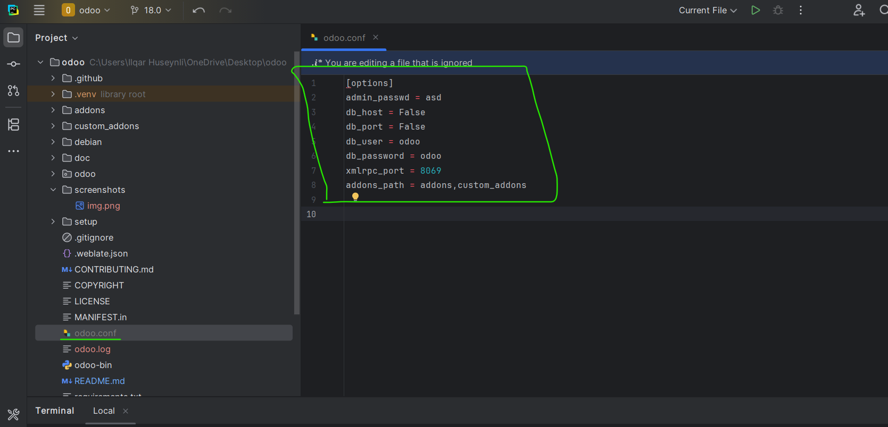
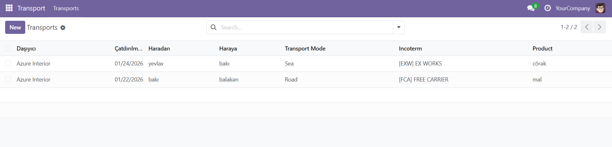
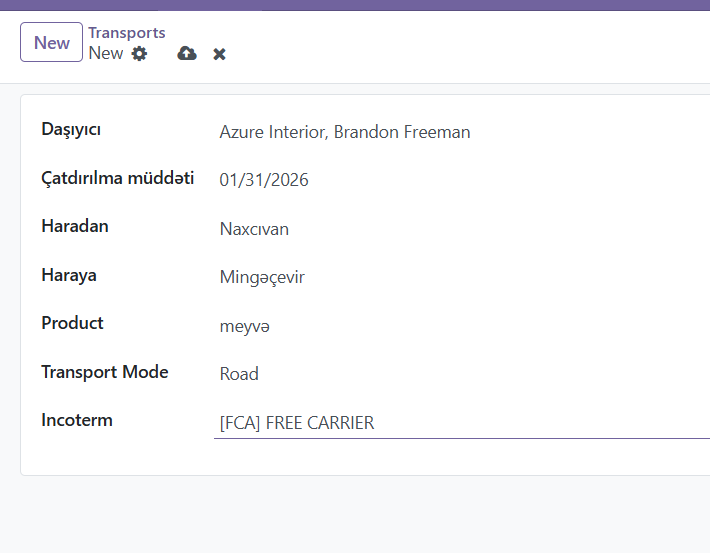
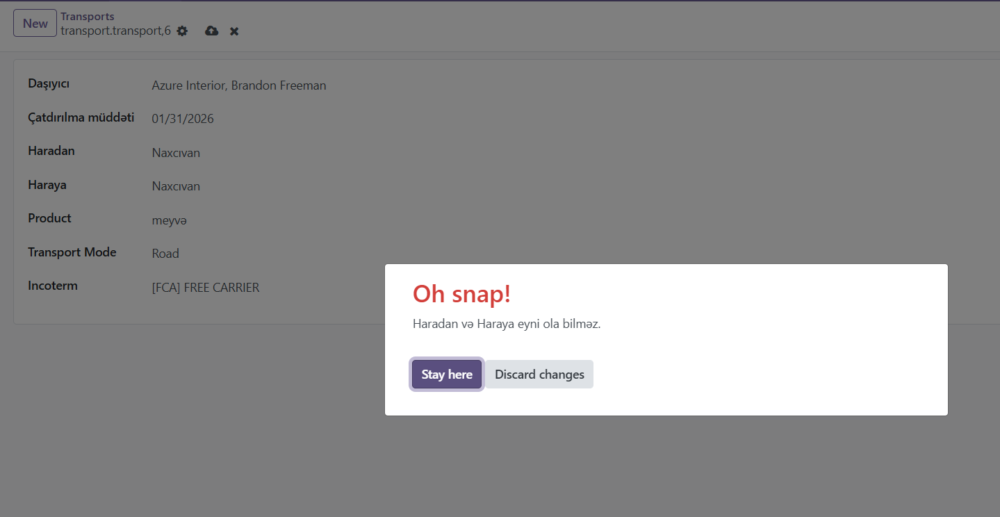
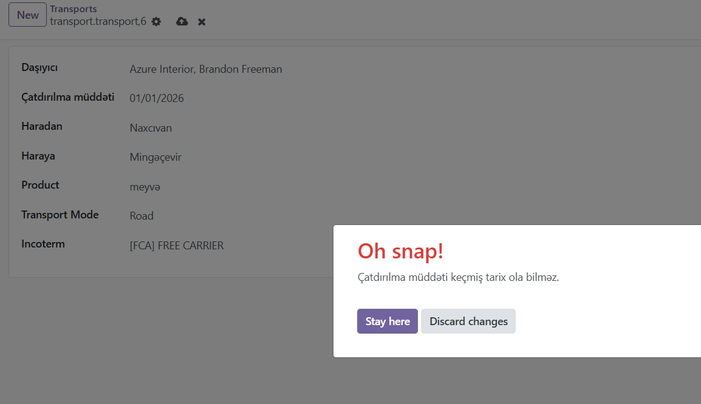

Bu modul verilmiş task tələblərinə uyğun olaraq hazırlanmışdır.

Transport modulu üçün yeni model yaradılmış və aşağıdakı məlumat sahələri əlavə edilmişdir:
- Daşıyıcı məlumatları (Carrier)
- Çatdırılma müddəti
- Haradan
- Haraya
- Məhsul (Product)
- Nəqliyyat növü (Transport mode)
- Incoterm

Modul üçün list və form view-lar hazırlanmış, istifadəçi interfeysindən məlumatların əlavə olunması və redaktə edilməsi təmin edilmişdir.

Model səviyyəsində sadə biznes qaydası (validation) tətbiq edilmişdir:

Bu lahiyə python 3.12 ilə yazılıb və odoo 18 versiyası üçün nəzərdə tutulmuşdur.

Modul işlək vəziyyətdədir və verilmiş tələbləri tam şəkildə qarşılayır.

